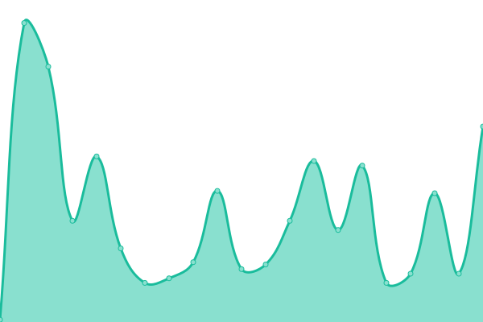
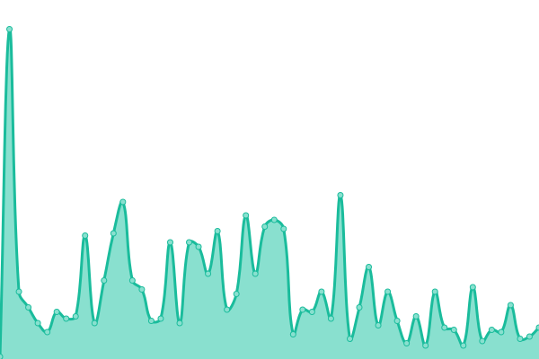

# [📈 Live Status](https://status.moleculesai.app): <!--live status--> **🟧 Partial outage**

This repository contains the open-source uptime monitor and status page for
[**Molecule AI**](https://moleculesai.app), powered by [Upptime](https://upptime.js.org).

## [📊 Overall Uptime](https://status.moleculesai.app)

<!--start: status pages-->
<!-- This summary is generated by Upptime (https://github.com/upptime/upptime) -->
<!-- Do not edit this manually, your changes will be overwritten -->
<!-- prettier-ignore -->
| URL | Status | History | Response time | Uptime |
| --- | ------ | ------- | ------------- | ------ |
|  [Customer app](https://app.moleculesai.app) | 🟩 Up | [customer-app.yml](https://git.moleculesai.app/molecule-ai/molecule-ai-status/commits/HEAD/history/customer-app.yml) | 

 278ms
     
 | 

<a href="https://status.moleculesai.app/history/customer-app">100.00%</a>
    

|  [Docs site](https://doc.moleculesai.app) | 🟩 Up | [docs-site.yml](https://git.moleculesai.app/molecule-ai/molecule-ai-status/commits/HEAD/history/docs-site.yml) | 

 247ms
     
 | 

<a href="https://status.moleculesai.app/history/docs-site">98.21%</a>
    

|  [Control plane API](https://api.moleculesai.app/health) | 🟩 Up | [control-plane-api.yml](https://git.moleculesai.app/molecule-ai/molecule-ai-status/commits/HEAD/history/control-plane-api.yml) | 

 168ms
     
 | 

<a href="https://status.moleculesai.app/history/control-plane-api">24.13%</a>
    

|  [Control plane — Legal pages](https://api.moleculesai.app/legal/terms) | 🟩 Up | [control-plane-legal-pages.yml](https://git.moleculesai.app/molecule-ai/molecule-ai-status/commits/HEAD/history/control-plane-legal-pages.yml) | 

 75ms
     
 | 

<a href="https://status.moleculesai.app/history/control-plane-legal-pages">24.13%</a>
    

|  [Landing page](https://www.moleculesai.app/) | 🟩 Up | [landing-page.yml](https://git.moleculesai.app/molecule-ai/molecule-ai-status/commits/HEAD/history/landing-page.yml) | 

 229ms
     
 | 

<a href="https://status.moleculesai.app/history/landing-page">100.00%</a>
    

|  [Canvas — pricing route](https://www.moleculesai.app/pricing) | 🟥 Down | [canvas-pricing-route.yml](https://git.moleculesai.app/molecule-ai/molecule-ai-status/commits/HEAD/history/canvas-pricing-route.yml) | 

 34ms
     
 | 

<a href="https://status.moleculesai.app/history/canvas-pricing-route">0.00%</a>
    

|  [Canvas — legal redirect](https://www.moleculesai.app/legal/terms) | 🟥 Down | [canvas-legal-redirect.yml](https://git.moleculesai.app/molecule-ai/molecule-ai-status/commits/HEAD/history/canvas-legal-redirect.yml) | 

 28ms
     
 | 

<a href="https://status.moleculesai.app/history/canvas-legal-redirect">0.00%</a>
    

<!--end: status pages-->

## License

- Code: [MIT](./LICENSE) © [Molecule AI](https://moleculesai.app)
- Website content and design: [Creative Commons Attribution 4.0 International](https://creativecommons.org/licenses/by/4.0/) © [Molecule AI](https://moleculesai.app)
