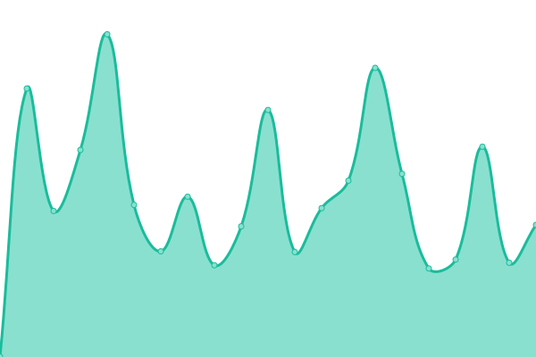

# [📈 Live Status](https://status.moleculesai.app): <!--live status--> **🟧 Partial outage**

This repository contains the open-source uptime monitor and status page for
[**Molecule AI**](https://moleculesai.app), powered by [Upptime](https://upptime.js.org).

## [📊 Overall Uptime](https://status.moleculesai.app)

<!--start: status pages-->
<!-- This summary is generated by Upptime (https://github.com/upptime/upptime) -->
<!-- Do not edit this manually, your changes will be overwritten -->
<!-- prettier-ignore -->
| URL | Status | History | Response time | Uptime |
| --- | ------ | ------- | ------------- | ------ |
|  [Control plane API](https://molecule-cp.fly.dev/health) | 🟥 Down | [control-plane-api.yml](https://github.com/Molecule-AI/molecule-ai-status/commits/HEAD/history/control-plane-api.yml) | 

 151ms
     
 | 

<a href="https://status.moleculesai.app/history/control-plane-api">99.99%</a>
    

|  [Control plane — Legal pages](https://molecule-cp.fly.dev/legal/terms) | 🟥 Down | [control-plane-legal-pages.yml](https://github.com/Molecule-AI/molecule-ai-status/commits/HEAD/history/control-plane-legal-pages.yml) | 

 66ms
     
 | 

<a href="https://status.moleculesai.app/history/control-plane-legal-pages">99.99%</a>
    

|  [Canvas — apex (marketing + pricing)](https://moleculesai.app/) | 🟩 Up | [canvas-apex-marketing-pricing.yml](https://github.com/Molecule-AI/molecule-ai-status/commits/HEAD/history/canvas-apex-marketing-pricing.yml) | 

 494ms
     
 | 

<a href="https://status.moleculesai.app/history/canvas-apex-marketing-pricing">100.00%</a>
    

|  [Canvas — pricing route](https://moleculesai.app/pricing) | 🟥 Down | [canvas-pricing-route.yml](https://github.com/Molecule-AI/molecule-ai-status/commits/HEAD/history/canvas-pricing-route.yml) | 

 50ms
     
 | 

<a href="https://status.moleculesai.app/history/canvas-pricing-route">0.02%</a>
    

|  [Canvas — legal redirect](https://moleculesai.app/legal/terms) | 🟥 Down | [canvas-legal-redirect.yml](https://github.com/Molecule-AI/molecule-ai-status/commits/HEAD/history/canvas-legal-redirect.yml) | 

 38ms
     
 | 

<a href="https://status.moleculesai.app/history/canvas-legal-redirect">0.01%</a>
    

<!--end: status pages-->

## License

- Code: [MIT](./LICENSE) © [Molecule AI](https://moleculesai.app)
- Website content and design: [Creative Commons Attribution 4.0 International](https://creativecommons.org/licenses/by/4.0/) © [Molecule AI](https://moleculesai.app)
